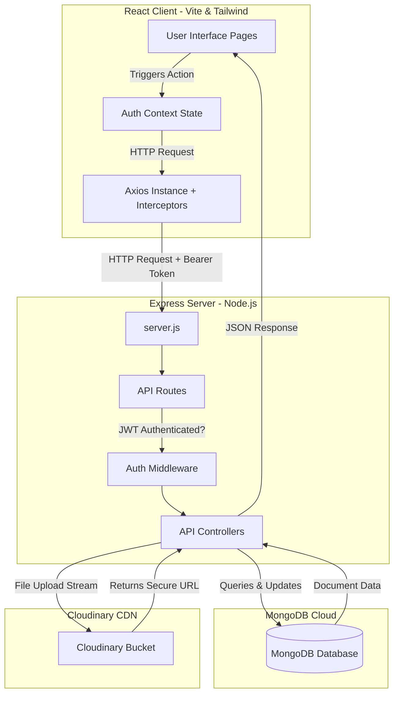

# Modern AI-Powered MERN Stack Job Portal
## College Project Documentation

---

## 1. Project Title
**Modern MERN Stack Job Portal with AI-Powered ATS Evaluator**

---

## 2. Abstract
The **Modern MERN Stack Job Portal** is a web-based application designed to bridge the gap between job seekers (students) and recruiters (employers). Built on the MERN (MongoDB, Express.js, React, Node.js) technology stack, this portal offers a rich, dual-portal ecosystem. 

Job seekers can create comprehensive profiles, upload resumes (stored in Cloudinary), search and filter jobs, and receive real-time, AI-driven ATS (Applicant Tracking System) compatibility reports comparing their skills with job requirements. 

Recruiters are provided with an employer dashboard to post jobs, manage active listings, upload company logos, and review candidates' cover letters and resume scores. Secured by JSON Web Token (JWT) authorization and encrypted passwords via bcryptjs, the platform delivers a premium, responsive, and performance-optimized experience.

---

## 3. Introduction
In today's highly competitive job market, finding matching career opportunities can be overwhelming for students, while screening thousands of applicants is tedious for recruiters. Traditional job portals act as static message boards, lacking interactive matching and optimization feedback. 

This project implements a dynamic, modern job portal leveraging the power of Javascript. The frontend is powered by **React** and **Vite** for incredibly fast user interactions, utilizing **Tailwind CSS** for responsive layout design and **Framer Motion** for animations. 

The backend runs on **Node.js** and **Express.js**, acting as a secure RESTful API layer that performs operations on a **MongoDB** database managed via **Mongoose**. Security, file uploads, and state preservation are fully integrated to make the recruitment flow seamless.

---

## 4. Problem Statement
Job search platforms often suffer from the following problems:
1. **Inefficient Screening**: Recruiters spend hours scanning resumes manually.
2. **Lack of Candidate Feedback**: Applicants submit resumes without knowing if their profile matches the job requirements.
3. **Complex User Interfaces**: Cluttered layouts make navigation difficult on smaller devices.
4. **Poor Performance & High Latency**: Monolithic applications result in slow loading states during search queries and document uploads.
5. **Security Risks**: Storing raw user passwords and exposing administrative endpoints without strict role checks leads to data leaks.

---

## 5. Objectives
The core objectives of the system are:
- **Build a Secure Portal**: Register users under distinct roles (`student` and `recruiter`) with secure passwords and JWT token checks.
- **Implement Resume Upload & Storage**: Provide memory-buffered file uploads streaming directly to Cloudinary storage.
- **Provide AI-Powered Match (ATS Score)**: Provide candidates with an automated matching engine checking their skills against job postings and listing recommendations.
- **Develop Interactive Dashboards**: Create dedicated UI views for recruiters to manage listings/applicants and candidates to track applications.
- **Enable Advanced Filters**: Implement live search based on keywords, experience, job type, and category filters.

---

## 6. Scope of the Project
- **In-Scope**:
  - Full registration, login, and profile modification.
  - PDF Resume uploading and secure cloud storage.
  - Job creation, editing, deletion, and active status control.
  - Job application submission with cover letters.
  - Candidate shortlisting, rejection, and application withdrawal.
  - Core search functionality and dynamic responsive UI layouts.
  - Client state caching and automatic redirect on token expiration.
- **Out-of-Scope (Future Enhancements)**:
  - Real-time chat system between recruiter and student.
  - Email notification alerts via SMTP (e.g., Nodemailer).
  - Integration with third-party payment gateways for premium postings.
  - Production-grade ML parsing models (the project currently uses a simulated AI analysis matching candidate skills arrays with job requirements).

---

## 7. Technologies Used

### Frontend Stack:
- **React (v19)**: Component-based client-side UI library.
- **Vite (v8)**: Fast build tool and local dev server.
- **Tailwind CSS (v4)**: Utility-first CSS framework for responsive layout styling.
- **React Router DOM (v7)**: Handles client-side routing and protected route management.
- **Axios**: Promised-based HTTP client used to interact with backend REST APIs.
- **Framer Motion**: Production-ready animation library for fluid transitions.
- **Lucide React**: Clean, modern icon library.

### Backend Stack:
- **Node.js**: Asynchronous event-driven JavaScript runtime.
- **Express.js (v4)**: Minimalist web framework for routing and middleware.
- **MongoDB**: NoSQL document-based database.
- **Mongoose (v8)**: Object Data Modeling (ODM) library for MongoDB.
- **JSON Web Token (JWT)**: Security token standard for signing and verifying payload data.
- **BcryptJS**: Hashing algorithm for password security.
- **Multer**: Middleware for handling `multipart/form-data` uploads.
- **Cloudinary**: Cloud-based media storage service.
- **Streamifier**: Converts buffers into readable streams for direct Cloudinary ingestion.

---

## 8. Project Architecture

The application follows a **Three-Tier Client-Server Architecture**:



1. **Presentation Layer (Frontend)**: React client interacts with the user. It manages local states (such as credentials, search parameters, active lists) and routes pages.
2. **Application Logic Layer (Backend)**: Express server handles routing requests, runs security checks (JWT verification), filters parameters, processes binary uploads via stream pipes, and sends structured JSON responses.
3. **Data Storage Layer (Database & Storage)**: MongoDB stores persistent user documents, job listings, and job applications. Cloudinary holds physical PDF resumes and JPG/PNG company logos, returning CDN URLs.

---

## 9. Frontend Explanation

### Contexts & Global State Management
1. **`AuthContext.jsx`**:
   - **Purpose**: Serves as the central state engine of the client app.
   - **State Variables**: 
     - `user`: Holds the parsed profile object of the logged-in user.
     - `token`: String token stored in `localStorage` to retain user sessions.
     - `jobs`: Array of all active job openings.
     - `applications`: Candidates' applications or recruiters' received applications.
     - `savedJobs`: Array of job IDs saved by a candidate.
     - `loading`: Boolean state controlling the loading fallback wrapper during session bootstrap.
   - **Operations**: Wraps all core authentication (`login`, `register`, `logout`) and transaction requests (`applyToJob`, `withdrawApplication`, `uploadResume`, `postJob`, `updateJob`, `deleteJob`). It maps backend user roles (`recruiter` / `student`) to user-friendly titles (`Employer` / `Job Seeker`).

2. **`ThemeContext.jsx`**:
   - **Purpose**: Tracks user visual preferences (Light/Dark mode) and mounts CSS toggles into the HTML document root.

---

### Pages

1. **Home (`Home.jsx`)**:
   - **Purpose**: The portal's main landing page.
   - **UI Design**: Modern hero banner with an integrated multi-field search bar (Title, Category, Location), dynamic category list grid, promotional ATS audit banner, and featured jobs carousel.
   - **State**: Tracks query, category, and location input fields.
   - **Transitions**: Staggered fade-up entry animations via Framer Motion.

2. **Login (`Login.jsx`)**:
   - **Purpose**: Authenticate returning users.
   - **Forms**: Input fields for Email and Password. Segmented custom buttons allow choosing between `Job Seeker` and `Employer`.
   - **Validation**: Ensures fields are non-empty and formatted. Catches backend error messages (e.g., "Invalid Credentials").

3. **Register (`Register.jsx`)**:
   - **Purpose**: Create a new account.
   - **Forms**: Full name, Email, Password, and Role selection.
   - **Validation**: Enforces basic validation checks before firing the dispatch.

4. **Job Search Directory (`JobList.jsx`)**:
   - **Purpose**: Display a searchable index of open positions.
   - **UI Design**: Multi-input filter header (Keywords, Location, Category dropdown, Job Type dropdown). Shows matching results using card layouts.
   - **State Management**: Syncs filters directly with URL Search Parameters.

5. **Job Detail View (`JobDetails.jsx`)**:
   - **Purpose**: Show specific job requirements, descriptions, salaries, and application buttons.
   - **ATS Comparison**: Automatically compares the candidate's skills array against the job's required skills, splitting them into "Matching Skills" (Green badge) and "Missing Skills" (Amber badge).
   - **API calls**: Hits `GET /api/jobs/:id` for fallback caching if details aren't in the global state.

6. **Candidate Dashboard (`Dashboard.jsx`)**:
   - **Purpose**: Candidate operations control panel.
   - **Tabs**:
     - `Overview`: Profile readiness stats (e.g., Profile completion bar), resume link, and the `ATSScoreCard` component.
     - `Applications`: A listing of applied roles, showing status badges (`Reviewing`, `Shortlisted`, `Rejected`) and expandable recruiter feedback messages.
     - `Saved Jobs`: List of jobs bookmarked by the applicant.
     - `Settings`: Quick configuration settings.

7. **Employer Dashboard (`EmployerDashboard.jsx`)**:
   - **Purpose**: Main control panel for recruiters.
   - **Tabs**:
     - `Overview`: Displays statistics widgets (Total jobs posted, active applications, candidate views).
     - `Post a Job`: Job creation form with fields for Title, Salary range, Type, Category, Experience, Skills tags, and Description.
     - `Manage Jobs`: Grid displaying listings posted by the employer, with options to Edit, Delete, or Upload Logo.
     - `Applicants`: Split pane list layout. The left side lists candidates who applied; clicking a candidate opens their resume, details, cover letter, and ATS compatibility score on the right side, along with shortlisting/rejection controls.

8. **Resume Evaluator (`ResumeUpload.jsx`)**:
   - **Purpose**: Provide candidates with resume optimization feedback.
   - **UI Design**: Drag-and-drop file upload zone, job title suggestion dropdown, experience select buttons, and text fields for job descriptions.
   - **Animations**: Loading states showing animated progress bars while simulating document processing stages.

9. **Edit Profile Page (`EditProfile.jsx`)**:
   - **Purpose**: Manage candidate user bio details.
   - **Form Fields**: Avatar upload, Name, Title, Email, Phone, Location, Bio, Skills tags (with add/delete key controls), and social handles (GitHub, LinkedIn, Portfolio).

---

### Key Components
- **`Navbar.jsx`**: Responsive floating header. Changes links dynamically depending on session status. Includes mobile menu toggles, notification indicators, user avatars, and the theme switch.
- **`ATSScoreCard.jsx`**: Renders a circular radial SVG gauge representing the candidate's match percentage. Displays detected matching skills, missing skills, and suggestions.
- **`JobCard.jsx`**: Cards showing title, salary, location badges, type tags, skills lists, and apply links.
- **`Sidebar.jsx`**: Layout navigation panel for dashboards.
- **`ThemeToggle.jsx`**: Interactive button switching client theme modes.
- **`CompanyLogos.jsx`**: Marquee animations displaying tech company logos.

---

## 10. Backend Explanation

### Project Directory Structure
```
server/
├── server.js                  # App Entry Point & Routing Registration
├── src/
│   ├── config/
│   │   ├── db.js              # Database connection
│   │   └── cloudinary.js      # Cloudinary setup
│   ├── models/
│   │   ├── User.js            # User Schema (Students & Recruiters)
│   │   ├── Job.js             # Job Schema
│   │   └── Application.js     # Application Schema
│   ├── middleware/
│   │   ├── authMiddleware.js  # JWT validation & role controls
│   │   ├── logoUploadMiddleware.js    # Multer logo configuration
│   │   └── resumeUploadMiddleware.js  # Multer PDF resume configuration
│   └── controllers/
│       ├── authController.js         # User registration, login & profile GET
│       ├── jobController.js          # CRUD controllers for job postings
│       ├── applicationController.js  # Application workflows (apply, review, get)
│       ├── uploadCompanyLogoController.js # Company logo upload to Cloudinary
│       └── userController.js         # Resume upload controller
```

### Server Entry (`server.js`)
Initiates environment configuration via `dotenv`, runs the MongoDB connection client, mounts cross-origin headers (`cors`), parses incoming payloads (`express.json()`), and registers the central API endpoint routers:
- `/api/auth` -> User authorization routes
- `/api/jobs` -> Job management routes
- `/api/applications` -> Application management routes
- `/api/users` -> User profile upload routes

### Security & Middlewares
1. **JWT Verification (`authMiddleware.js` → `protect`)**:
   - Extracts string tokens from incoming HTTP request headers:
     `Authorization: Bearer <JWT_TOKEN>`
   - Calls `jwt.verify()` using the server's private `JWT_SECRET` key.
   - Decodes payload object `{ id, role }` and binds it to `req.user`.

2. **Role Authorization Checks**:
   - `authorizeRecruiter`: Validates that `req.user.role === 'recruiter'`. Block requests with a `403 Forbidden` error if invalid.
   - `authorizeStudent`: Validates that `req.user.role === 'student'`. Block requests with a `403 Forbidden` error if invalid.

3. **Multer Buffering Middleware**:
   - `resumeUploadMiddleware.js`: Intercepts files submitted via `resume` form-data fields. Rejects documents that do not have `application/pdf` mime types or exceed 5MB.
   - `logoUploadMiddleware.js`: Intercepts images submitted via `logo` form-data fields. Accepts only `image/jpg`, `image/jpeg`, and `image/png` formats, with a 2MB size limit.

---

## 11. MongoDB Database Schemas & Relations

### Collections

#### 1. Users Collection (`User.js` Schema)
Stores credentials and profiles for both candidates (students) and recruiters.
```javascript
const UserSchema = new mongoose.Schema({
    name: { type: String, required: true, trim: true },
    email: { type: String, required: true, unique: true, lowercase: true },
    password: { type: String, required: true },
    role: { type: String, enum: ["student", "recruiter"], default: "student" },
    resume: {
        public_id: { type: String, default: "" },
        url: { type: String, default: "" }
    }
}, { timestamps: true });
```
- **Relationships**:
  - `postedBy` field in `Job` schemas refers to this collection using an `ObjectId`.
  - `applicant` field in `Application` schemas refers to this collection using an `ObjectId`.

#### 2. Jobs Collection (`Job.js` Schema)
Stores job listing posts.
```javascript
const JobSchema = new mongoose.Schema({
    title: { type: String, required: true },
    company: { type: String, required: true },
    description: { type: String },
    location: { type: String },
    salary: {
        min: { type: Number },
        max: { type: Number }
    },
    skills: { type: [String] },
    jobType: { type: String, enum: ["full-time", "part-time", "contract", "internship"], default: "full-time" },
    experience: { type: String, enum: ["Fresher", "1-2 Years", "2-4 Years", "4-6 Years", "6+ Years"], default: "Fresher" },
    vacancies: { type: Number, default: 1, min: 1 },
    isActive: { type: Boolean, default: true },
    applicationDeadline: { type: Date },
    postedBy: { type: mongoose.Schema.Types.ObjectId, ref: "User", required: true },
    companyLogo: {
        public_id: { type: String, default: "" },
        url: { type: String, default: "" }
    }
}, { timestamps: true });
```
- **Relationships**:
  - `postedBy`: A reference pointing to the `User` model, establishing that each job is created by a recruiter.
  - `job` field in `Application` schemas refers back to this collection.

#### 3. Applications Collection (`Application.js` Schema)
Stores job applications submitted by candidates.
```javascript
const ApplicationSchema = new mongoose.Schema({
    applicant: { type: mongoose.Schema.Types.ObjectId, ref: "User", required: true },
    job: { type: mongoose.Schema.Types.ObjectId, ref: "Job", required: true },
    status: { type: String, enum: ["pending", "accepted", "rejected"], default: "pending" },
    coverLetter: { type: String, trim: true },
    feedback: { type: String, trim: true }
}, { timestamps: true });
```
- **Relationships**:
  - `applicant`: Reference pointing to the `User` schema.
  - `job`: Reference pointing to the `Job` schema.
  - This schema creates a many-to-many relationship mapping between `Users` and `Jobs`.

---

## 12. API Documentation

| Method | Endpoint | Request Body | Response Success | Target Page | Purpose |
| :--- | :--- | :--- | :--- | :--- | :--- |
| **POST** | `/api/auth/register` | `{name, email, password, role}` | `201 Created` + user obj | Register Page | Create a new user account |
| **POST** | `/api/auth/login` | `{email, password}` | `200 OK` + JWT Token & user info | Login Page | Authenticate credentials and retrieve session token |
| **GET** | `/api/auth/profile` | *None (Requires Token)* | `200 OK` + full profile details | Edit Profile, Dashboard | Fetch user profile data |
| **POST** | `/api/jobs` | `{title, company, description, location, salary: {min, max}, skills: [], jobType, experience}` | `201 Created` + job details | Employer Dashboard | Recruiter posts a new job opening |
| **GET** | `/api/jobs` | *None* | `200 OK` + jobs array | Home, JobList | Fetch all active jobs |
| **GET** | `/api/jobs/myjobs` | *None (Requires Token)* | `200 OK` + recruiter's jobs array | Employer Dashboard | Retrieve jobs posted by the logged-in recruiter |
| **GET** | `/api/jobs/:id` | *None* | `200 OK` + job details | JobDetails | Get detailed job specifications by ID |
| **PUT** | `/api/jobs/:id` | `{fields to update}` | `200 OK` + updated job details | Employer Dashboard | Edit a job posting |
| **DELETE**| `/api/jobs/:id` | *None (Requires Token)* | `200 OK` + success message | Employer Dashboard | Delete a job posting |
| **PUT** | `/api/jobs/:jobId/upload-logo` | `multipart/form-data` file field: `logo` | `200 OK` + image URL & ID | Employer Dashboard | Upload/update company logo to Cloudinary |
| **GET** | `/api/applications/myapplications` | *None (Requires Token)* | `200 OK` + applications array | Dashboard (Student) | Get applicant's applications |
| **POST** | `/api/applications/:jobId` | `{coverLetter}` *(Requires Token)* | `201 Created` + application obj | JobDetails | Submit application for a job |
| **DELETE**| `/api/applications/:applicationId` | *None (Requires Token)* | `200 OK` + success message | Dashboard (Student) | Withdraw an active application |
| **GET** | `/api/applications/job/:jobId` | *None (Requires Token)* | `200 OK` + applicants details | Employer Dashboard | Recruiter reviews candidates for a job listing |
| **PUT** | `/api/applications/:applicationId/status` | `{status, feedback}` *(Requires Token)* | `200 OK` + application obj | Employer Dashboard | Recruiter shortlists or rejects a candidate |
| **PUT** | `/api/users/upload-resume` | `multipart/form-data` file field: `resume` | `200 OK` + resume url | ResumeUpload | Upload student resume to Cloudinary |

---

## 13. Frontend to Backend Connection

### Configuration Setup
The frontend uses **Axios** to communicate with backend APIs. The configuration is defined in [api.js](file:///c:/Users/user/OneDrive/Desktop/JOBPORTAL/client/src/utils/api.js).
```javascript
const api = axios.create({
  baseURL: import.meta.env.VITE_API_URL || 'http://localhost:5000/api',
  timeout: 15000,
});
```

### Axios Interceptors

1. **Request Interceptor (Attaching Tokens)**:
   Whenever the frontend initiates an API request, the interceptor checks `localStorage` for an active `token`. If present, it attaches it to the request headers.
   ```javascript
   api.interceptors.request.use((config) => {
     const token = localStorage.getItem('token');
     if (token) {
       config.headers.Authorization = `Bearer ${token}`;
     }
     return config;
   });
   ```

2. **Response Interceptor (Session Expiration Check)**:
   If the backend returns a `401 Unauthorized` status (due to an invalid or expired token), the interceptor automatically removes the user session data and redirects the client to the login page.
   ```javascript
   api.interceptors.response.use(
     (response) => response,
     (error) => {
       if (error.response && error.response.status === 401) {
         localStorage.removeItem('token');
         localStorage.removeItem('user');
         if (window.location.pathname !== '/login' && window.location.pathname !== '/') {
           window.location.href = '/login?expired=true';
         }
       }
       return Promise.reject(error);
     }
   );
   ```

---

## 14. Backend to MongoDB Connection

### Mongoose Connection Setup
The database connection is managed in [db.js](file:///c:/Users/user/OneDrive/Desktop/JOBPORTAL/server/src/config/db.js). It retrieves the connection string from environment variables and connects asynchronously.
```javascript
const connectDB = async () => {
    try {
        await mongoose.connect(process.env.MONGODB_URI);
        console.log("MongoDB connected successfully");
    } catch (err) {
        console.error(err.message);
        process.exit(1);
    }
}
```

### Mongoose Operations in Controllers
The backend uses Mongoose methods to perform CRUD operations on database collections:
- **CREATE**: `User.create()`, `Job.create()`, `Application.create()`
- **READ**: `Job.find({ isActive: true })`, `User.findOne({ email })`, `Application.find().populate('applicant')`
- **UPDATE**: `Job.findByIdAndUpdate()`, `user.save()`
- **DELETE**: `application.deleteOne()`, `job.deleteOne()`

---

## 15. Complete User Flow

```
1. Guest User Opens Portal
   └── Renders Home Page (Navbar shows Login / Register options).

2. User Registration / Authenticates Session
   ├── Inputs fields in Register Page → Hits API POST /api/auth/register.
   └── Inputs fields in Login Page → Hits API POST /api/auth/login.
       ├── Backend hashes/compares passwords via bcryptjs.
       ├── Generates a JWT signed token with user ID and role details.
       └── Returns JWT token + User Info payload.
       └── Client receives token → Saves to localStorage → Sets useAuth() context state.

3. Protected Page Routing
   └── React Router guards dashboard routes based on AuthContext state.
       ├── If Candidate (Student): Renders Candidate Dashboard.
       └── If Recruiter (Employer): Renders Employer Dashboard.

4. Profile Settings & Resume Parsing Flow
   ├── Candidate opens Edit Profile page → Hits PUT /api/users/upload-resume.
   │   ├── Multer buffers PDF resume → Cloudinary stream uploads file.
   │   └── Save URL in Mongoose User Document.
   └── Renders ATS Score Card based on uploaded resume.

5. Job Application Workflow
   ├── Candidate browses Job Listings Page (JobList) -> Clicks "Apply Now" (JobDetails).
   │   └── Inputs Cover Letter -> Hits API POST /api/applications/:jobId.
   │       └── Mongoose inserts a new Application document matching candidate ID and job ID.
   └── Recruiter logs in -> Navigates to Applicants tab -> Fetches applicants via GET /api/applications/job/:jobId.
       ├── Recruiter reviews cover letter, details, and resume.
       └── Recruiter clicks Shortlist / Reject -> Updates application status.

6. UI Updates
   └── State changes dynamically, updating components instantly without page reloads.
```

---

## 16. Key Features Explained Simply

1. **Dual-Role Portal Architecture**: Dedicated dashboards keep candidates focused on applying and recruiters on screening.
2. **AI-Powered ATS Score Card**: Compares resumes against job requirements to calculate compatibility. This helps students optimize their resumes before submitting.
3. **Multi-Criteria Job Filtering**: Candidates can filter listings by keywords, experience, job type, and category.
4. **Cloud-Based Resume & Logo Uploads**: Store files securely in the cloud without slowing down the server.
5. **Interactive Applicant Tracking System**: Recruiters can review and update application statuses (Shortlist/Reject) in real-time.

---

## 17. Security Features
- **Password Salting & Hashing**: Passwords are encrypted using `bcryptjs` before storage, protecting them from decryption.
- **Stateless Authentication (JWT)**: Secure user sessions using signing keys. Tokens expire automatically after 7 days.
- **Route Authorization Guard**: Enforces middleware checks so candidates cannot access recruiter actions, and vice-versa.
- **File Upload Validation**: Restricts resume uploads to PDFs and company logos to JPG/PNG images under strict file size limits.

---

## 18. Performance Optimization
- **Memory Buffering**: Multer processes uploads in memory streams, bypassing temporary server storage to speed up file uploads.
- **Database Indexing**: The `User` email field is marked as `unique` and indexed by MongoDB to optimize lookup operations.
- **Selective Populating**: MongoDB requests fetch only necessary fields (e.g., `.populate("postedBy", "name email")`), reducing data payload sizes.

---

## 19. Responsive Design
Built using Tailwind CSS utilities, the application features:
- **Responsive Navigation**: Collapsible mobile hamburger menus.
- **Adaptive Grid Layouts**: Columns adapt dynamically from 1 column on mobile to 3 columns on desktop.
- **Touch-Friendly Controls**: Large buttons, clear select inputs, and swipe-friendly components for seamless mobile navigation.

---

## 20. Codebase Folder Structure

### Frontend Structure (`client/`)
```
client/
├── package.json               # Frontend dependencies & scripts
├── vite.config.js             # Vite development server configuration
├── index.html                 # Main HTML entry point
├── src/
│   ├── main.jsx               # React DOM bootstrap entry point
│   ├── App.jsx                # Core application router
│   ├── index.css              # Main stylesheet containing Tailwind configurations
│   ├── components/            # Reusable UI widgets
│   │   ├── ATSScoreCard.jsx   # Radial gauge visualization component
│   │   ├── CompanyLogos.jsx   # Logo marquee animation banner
│   │   ├── Footer.jsx         # Global footer component
│   │   ├── JobCard.jsx        # Job description overview widget
│   │   ├── Navbar.jsx         # Floating dynamic header navigation panel
│   │   ├── Sidebar.jsx        # Dashboard layout sidebar
│   │   ├── SocialLogin.jsx    # Social provider interfaces
│   │   └── ThemeToggle.jsx    # Light / Dark theme toggling button
│   ├── context/               # Global state contexts
│   │   ├── AuthContext.jsx    # Authentication & job transaction states
│   │   └── ThemeContext.jsx   # Light/Dark mode state
│   ├── pages/                 # Full screen page views
│   │   ├── Dashboard.jsx      # Candidate dashboard
│   │   ├── EmployerDashboard.jsx # Employer dashboard
│   │   ├── Home.jsx           # Landing home page
│   │   ├── JobList.jsx        # Job listings directory page
│   │   ├── JobDetails.jsx     # Job details page
│   │   ├── EditProfile.jsx    # Profile details form editor
│   │   └── ResumeUpload.jsx   # Resume optimizer & ATS analyzer page
│   └── utils/                 # Utilities and helper scripts
│       ├── api.js             # Axios client instance with interceptors
│       ├── animations.js      # Animation presets (Framer motion)
│       └── logos.js           # Company logo helper mappings
```

### Backend Structure (`server/`)
```
server/
├── package.json               # Backend dependencies & script tasks
├── server.js                  # Main server entry file
├── .env                       # Environment variables config file
└── src/
    ├── config/                # Service configurations
    │   ├── db.js              # Database connection
    │   └── cloudinary.js      # Cloudinary API key settings
    ├── controllers/           # API request controller logic
    │   ├── authController.js  # Registration, login & profile GET logic
    │   ├── jobController.js   # CRUD operations logic for job postings
    │   ├── applicationController.js # Workflows for applying & review
    │   ├── userController.js  # Candidate resume upload controller
    │   └── uploadCompanyLogoController.js # Recruiter logo upload controller
    ├── middleware/            # Custom express middlewares
    │   ├── authMiddleware.js  # JWT validation & role permissions guards
    │   ├── logoUploadMiddleware.js # Multer configuration for logo uploads
    │   └── resumeUploadMiddleware.js # Multer configuration for resume uploads
    ├── models/                # MongoDB Schema configurations
    │   ├── User.js            # User entity schema (students & recruiters)
    │   ├── Job.js             # Job posting details entity schema
    │   └── Application.js     # Job applications mapping schema
    └── routes/                # Endpoint routes mappings
        ├── authRoutes.js      # Authentication endpoints
        ├── jobRoutes.js       # Job postings endpoints
        ├── applicationRoutes.js # Job application endpoints
        └── userRoutes.js      # User resume upload endpoints
```

---

## 21. Screenshots Section (Placeholders)

### [Screenshot Placeholder: Home Page]
*Description: Landing screen showing the hero section, search form, and job category grid.*

### [Screenshot Placeholder: Login Page]
*Description: Credentials interface with candidate and employer selection toggles.*

### [Screenshot Placeholder: Candidate Dashboard]
*Description: Candidate dashboard displaying profile overview, completion metrics, and the ATS matching score.*

### [Screenshot Placeholder: Resume Evaluator & ATS Results]
*Description: File upload zone showing the calculated ATS score, detected skills, and recommended improvements.*

### [Screenshot Placeholder: Employer Dashboard - Posting Form]
*Description: Form for recruiters to fill in job details, location, salary ranges, and required skills.*

### [Screenshot Placeholder: Employer Dashboard - Applicants Manager]
*Description: Split-screen interface showing candidate profiles, resumes, cover letters, and shortlisting tools.*

---

## 22. Challenges Faced
1. **Managing Asynchronous Streams**: Routing binary uploads to Cloudinary without creating temporary storage folders was tricky. Resolved by buffering data in memory via Multer and piping it to Cloudinary using `Streamifier`.
2. **Cross-Origin Resource Sharing (CORS)**: Solved CORS authorization errors during local development by implementing custom Express routing settings.
3. **Data Hydration & Fallback Routes**: Designed fallback states in `AuthContext.jsx` to prevent dashboard page crashes if certain optional backend profile endpoints were missing or failed.
4. **Relational Population**: Cleaned up complex populate paths in Mongoose, ensuring candidate queries retrieve nested details without causing high database read latency.

---

## 23. Future Enhancements
- **SMTP Notification Pipeline**: Integrate nodemailer to send automated email alerts to candidates when their application status changes.
- **Real-Time WebSockets Messaging**: Add live chat rooms to let recruiters interview candidates directly inside the portal.
- **Genuine AI Classification**: Replace simulated scoring engines with OCR tools (like PDF.js or Tesseract) to parse text and match skills programmatically.
- **Payment Portal Integration**: Add a payment gateway (e.g., Stripe) to monetize featured job postings.

---

## 24. Conclusion
The **Modern MERN Stack Job Portal** provides a complete and robust platform for recruitment management. By leveraging React's dynamic component rendering, Tailwind CSS's responsiveness, Node/Express's scalable routing, and MongoDB's flexible schemas, the portal ensures high speed and security. The addition of the AI ATS Score Card enhances candidate engagement and offers a modern, interactive experience.

---
---

## 25. Viva Questions & Answers

#### Q1: What is the MERN stack?
**Answer**: MERN is a JavaScript stack used to build full-stack web applications. It consists of:
- **M**ongoDB: NoSQL database.
- **E**xpress.js: Web application framework for Node.js.
- **R**eact: Library for building user interfaces.
- **N**ode.js: JavaScript runtime environment.

#### Q2: How does authentication work in this application?
**Answer**: Authentication is stateless and uses **JSON Web Tokens (JWT)**. When a user logs in, the backend hashes the password, compares it using `bcryptjs`, and returns a signed token containing their ID and role. The frontend stores this token in `localStorage` and automatically attaches it to the HTTP Authorization headers of subsequent API requests.

#### Q3: What is the purpose of JWT?
**Answer**: JWT enables stateless authentication. Instead of storing session records on the server, the server issues a signed token to the client. The client sends this token with each request, and the server verifies its digital signature, reducing database load and server resource usage.

#### Q4: Why is Mongoose used alongside MongoDB?
**Answer**: MongoDB is a schema-less NoSQL database. **Mongoose** is an Object Data Modeling (ODM) library that defines structured schemas, validates data types, handles middleware, and provides query helpers, making database interactions more predictable.

#### Q5: How are resume and logo files uploaded and stored?
**Answer**: Files are sent from the client as multipart form data. **Multer** intercepts the requests on the backend, buffering files in memory. **Cloudinary SDK** uploads the buffered files to cloud storage, and the secure URLs returned are saved in MongoDB documents.

#### Q6: How does the Axios request interceptor work?
**Answer**: In [api.js](file:///c:/Users/user/OneDrive/Desktop/JOBPORTAL/client/src/utils/api.js), the request interceptor intercepts outbound requests, reads the token from `localStorage`, and appends it to the authorization headers as a Bearer token:
`config.headers.Authorization = 'Bearer ' + token`

#### Q7: How does the Axios response interceptor handle expired tokens?
**Answer**: If a request fails with a `401 Unauthorized` status (often due to an expired token), the response interceptor automatically removes the user session data and redirects the client to the login page with an expiration query parameter.

#### Q8: What are protected routes, and how are they implemented?
**Answer**: Protected routes restrict page access based on authentication status. In `App.jsx` and `Dashboard.jsx`, the application checks the `user` state inside the `AuthContext`. If no user is logged in, the client redirects the request to `/login`.

#### Q9: What is the difference between `student` and `recruiter` roles in the backend database?
**Answer**: The user schema includes a `role` field that can be either `"student"` or `"recruiter"`. The auth middleware checks this role to restrict endpoints: `authorizeStudent` limits apply actions to candidate users, while `authorizeRecruiter` limits post and update actions to recruiter accounts.

#### Q10: How does the application handle password security?
**Answer**: User passwords are encrypted using `bcryptjs` before storage. When registering, the application generates a cryptographic salt and hashes the password 10 times. During login, `bcrypt.compare()` hashes the input password and checks it against the database hash.

#### Q11: Explain the Mongoose schemas and relationships in this project.
**Answer**:
- **User**: Stores profile data, credentials, and resume URLs.
- **Job**: Stores job details and references the recruiter ID in `postedBy` (`ref: "User"`).
- **Application**: Links an applicant (`ref: "User"`) to a job (`ref: "Job"`) and stores application statuses and cover letters.

#### Q12: How are CORS issues handled?
**Answer**: CORS (Cross-Origin Resource Sharing) issues are resolved by using the `cors()` middleware in Express, which tells the browser to accept HTTP requests from the client's port or domain.

#### Q13: What does the Mongoose `.populate()` function do?
**Answer**: Mongoose documents store relational references as ObjectIDs. The `.populate()` function searches referenced collections and automatically replaces these IDs with the actual linked documents (e.g., fetching a recruiter's name and email for a job post).

#### Q14: How does the client-side simulated AI ATS Match score work?
**Answer**: When a candidate uploads their resume, the platform checks their skills array against the job requirements. It calculates a matching score based on overlaps, highlights missing requirements, and suggests improvements to help candidates optimize their profiles.

#### Q15: Why is Vite used instead of Create React App (CRA)?
**Answer**: **Vite** is a modern build tool that uses native ES modules to compile code. It starts the local server instantly and handles hot module updates much faster than Webpack-based tools like CRA, providing a better developer experience.

#### Q16: How is responsive design achieved in this project?
**Answer**: Responsive design is built using Tailwind CSS utility classes. Layouts adapt dynamically to screen size changes using breakpoint prefixes (e.g., `grid-cols-1 md:grid-cols-3` or `hidden sm:block`).

#### Q17: What are environment variables, and why are they used?
**Answer**: Environment variables store sensitive settings (like `MONGODB_URI`, `JWT_SECRET`, and Cloudinary keys) outside the source code. The project uses `dotenv` to load these settings from a `.env` file on startup.

#### Q18: Explain the purpose of `express.json()` middleware.
**Answer**: By default, Express cannot parse incoming request body data. The `express.json()` middleware parses incoming JSON request bodies and makes the parsed data available under the `req.body` object.

#### Q19: What is the purpose of `Streamifier` in the backend?
**Answer**: The Cloudinary SDK expects a readable file stream to upload media. Since Multer stores files in memory buffers, `streamifier.createReadStream()` is used to convert these buffers into readable streams, allowing direct file transmission.

#### Q20: How can we improve this application in the future?
**Answer**: Future improvements include integrating a WebSocket system for live chat, setting up SMTP notifications, implementing an OCR resume reader for automated keyword extraction, and adding a payment gateway for premium job posts.

---
---

## 26. 10-Minute Presentation Script (Presentation & Viva Guide)

### Slide 1: Introduction (Time: 0:00 - 1:00)
> "Good morning, respected teachers and examiners. Today, I am presenting my MERN Stack Job Portal project. The main goal of this web application is to simplify the hiring process for recruiters and job seekers. Unlike static job boards, our portal features dual-role dashboards, dynamic search filters, and an AI-powered ATS Match score evaluator to give candidates instant feedback on how well their profiles align with job requirements."

### Slide 2: Tech Stack Choice (Time: 1:00 - 2:30)
> "Let's discuss the technology stack. We chose the MERN stack because of its high performance and unified language architecture:
> - **MongoDB** provides a flexible document schema to store users, job posts, and application records.
> - **Express.js and Node.js** build a lightweight, event-driven REST API layer.
> - **React** handles dynamic client-side rendering.
> - **Vite** compiles assets quickly, and **Tailwind CSS** helps build a responsive, modern interface.
> - For security, we use **JWT** for stateless authorization, and **bcryptjs** for password encryption. Resumes are uploaded to **Cloudinary** using memory streams via **Multer** and **Streamifier**."

### Slide 3: Application Architecture (Time: 2:30 - 4:30)
> "The system follows a three-tier architecture:
> 1. The **Client Layer** is built with React. It uses Axios request interceptors to automatically attach JWT authorization headers and handles expired sessions using response interceptors.
> 2. The **Server Layer** uses Express routers and controllers. The auth middleware verifies JWT tokens and checks user roles to protect secure endpoints.
> 3. The **Database Layer** uses Mongoose schemas to map relationships between the User, Job, and Application collections."

### Slide 4: Key Features Demo (Time: 4:30 - 7:30)
> "Our application features two distinct user portals:
> - **For Candidates**: Applicants can edit their profiles, list their skills, and upload PDF resumes. The system compares their skills against job listings to calculate a match score, highlight missing keywords, and suggest improvements.
> - **For Recruiters**: Employers can post job listings, upload company logos, and manage active jobs. In the applicant tracking section, recruiters can review applicant resumes, cover letters, and match scores, and shortlist or reject candidates with custom feedback."

### Slide 5: Challenges & Solutions (Time: 7:30 - 9:00)
> "During development, we faced some challenges:
> 1. **Uploading files to the cloud**: To avoid saving temporary files on the server, we buffered files in memory and piped them directly to Cloudinary using Streamifier.
> 2. **Authentication checks**: We built Express middleware that verifies JWT signatures and validates roles, securing administrative endpoints from unauthorized access.
> 3. **Axios integration**: We configured request and response interceptors to automatically attach session tokens and handle expired tokens."

### Slide 6: Summary & Conclusion (Time: 9:00 - 10:00)
> "In conclusion, the project successfully implements a modern, secure, and responsive job portal. The MERN stack handles data storage, security, and UI rendering efficiently. In the future, we plan to add WebSocket messaging, automated email notifications, and an actual OCR parser to read resumes. Thank you. I am now open to your questions."

---
---

## 27. Technology Selection Justifications

### 1. React & Vite
- **Why**: React's Virtual DOM makes UI updates quick and responsive. Using Vite instead of standard build tools improves build times and enables instant hot module replacement (HMR), speeding up development.

### 2. Node.js & Express.js
- **Why**: Node.js uses asynchronous, non-blocking input/output processing, which helps the server handle multiple concurrent requests efficiently. Express.js provides a clean, simple framework to manage routing, parse JSON, and run authentication middleware.

### 3. MongoDB & Mongoose
- **Why**: MongoDB's document-based model is flexible, allowing us to store dynamic user and job profile data without strict database schemas. Mongoose provides validation models, relational schema features, and structured query building for clean database management.

### 4. JSON Web Tokens (JWT)
- **Why**: JWT enables stateless session authentication, removing the need to store session records on the server. The signed token is saved on the client side and verified by the server for each request, making the system easy to scale.

### 5. Tailwind CSS
- **Why**: Tailwind CSS provides utility classes that speed up styling. Its mobile-first breakpoint system makes it easy to build a responsive interface that looks great on all screen sizes.
